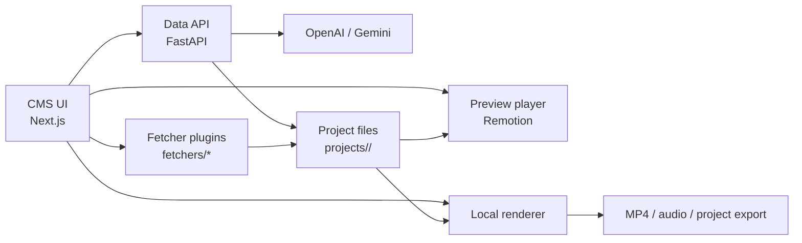

# Videofy Minimal


Videofy Minimal is a local tool for turning news articles into short videos for digital signage screens.

It fetches article content, generates a short manuscript, matches visuals, produces narration, and renders a final video through a review flow in the CMS UI.

Here is an example video from one of our brands: [example_video_e24.mp4](./example_video_e24.mp4)

This repository is designed to run on a laptop with OpenAI and Gemini credentials. It keeps the core workflow, but leaves out most of the internal integrations and infrastructure used in Schibsted's full Videofy setup.

Found a problem or want to chat about the project? Open an issue or join our [Discord server](https://discord.gg/vFvvdC3B)

## What This Fork Tries To Change

This fork is an experiment based on `schibsted/videofy_minimal`.

The goal is not to rebuild the whole system from scratch. The goal is to keep the original article -> manuscript -> media matching -> voice -> render flow, while making the AI parts easier to swap and easier to run on a laptop.

Compared to the original repo, this fork is trying to do the following:
- keep the original orchestration and prompt-driven workflow as much as possible
- make the LLM provider selectable per node instead of assuming a single provider everywhere
- support OpenAI or Gemini for text-reasoning stages such as script generation, image description, asset placement, and image-prompt building
- add AI image generation as a new explicit node in the pipeline instead of treating images as article-only inputs
- support two image-generation paths: OpenAI images and Nano Banana
- replace the old ElevenLabs dependency with Gemini TTS so the repo can run with `OPENAI_API_KEY` plus `GEMINI_API_KEY`
- make the CMS friendlier for experimentation by exposing provider/model switching in the UI
- improve local reliability on a laptop by cleaning up error handling, legacy project loading, and environment-specific issues

In practical terms, this fork is moving the project from "minimal newsroom video generator" toward "local narrative/explainer video workflow with swappable AI nodes."

## What We Tried Not To Change

The main intention was to avoid rewriting the whole product logic.

What we tried to preserve from the original repo:
- the overall manuscript generation and processing pipeline
- the fetch -> generate -> review -> process -> render shape of the workflow
- the brand-driven configuration model
- the existing prompt instructions used by the original manuscript and media-analysis stages
- the local project-folder structure under `projects/<projectId>/`

So the core idea of this fork is:
- keep the original pipeline shape
- add node-level model routing
- add image generation as one more node
- make the stack easier to test locally

## What It Does

Videofy Minimal takes content from a source such as Reuters, AP, or a test web URL, builds a manuscript, matches media, generates voiceover, and renders a video.

The result is a local MP4 with a human-in-the-loop workflow in the CMS UI, so editors can review, tweak, and rerun before rendering.

## Architecture

At a high level, the CMS orchestrates fetching, generation, preview, and rendering, while project state is stored locally under `projects/<projectId>/`.



The CMS is the operator surface, the FastAPI service handles generation and processing, and each project is persisted under `projects/<projectId>/`.

## Quickstart

### 1. Install Dependencies (macOS with Homebrew)

```bash
brew install uv node ffmpeg
```

You also need:
- Python 3.12
- npm (comes with Node)

### 2. Configure Environment

```bash
cp .env.example .env
```

Add your API credentials in `.env`:
- `OPENAI_API_KEY`
- `GEMINI_API_KEY` or `GOOGLE_API_KEY`

### 3. Install Project Dependencies

```bash
uv sync
npm install
```

### 4. Start Everything

```bash
make dev
```

If you want hotspot model support while using `make dev`, run:

```bash
make dev HOTSPOT=1
```

Open:
- CMS: `http://127.0.0.1:3000`
- API: `http://127.0.0.1:8001`

## Docker Compose

To run the CMS and API in containers instead:

```bash
docker compose up --build
```

Docker Compose reads the same local `.env` file for values such as `OPENAI_API_KEY` and `GEMINI_API_KEY`.

Open:
- CMS: `http://127.0.0.1:3000`
- API: `http://127.0.0.1:8001`

## Projects and Folder Structure

Every run is stored as a project in `projects/<projectId>/`.

Projects are split into:
- `input`: imported source files and article data
- `working`: intermediate and editable generation state
- `output`: final processed files and rendered videos

Example layout:

```text
projects/
  <projectId>/
    generation.json
    input/
      article.json
      images/
      videos/
    working/
      manuscript.json
      cms-generation.json
      config.override.json
      analysis/
      audio/
      uploads/
    output/
      processed_manuscript.json
      render-vertical.mp4
      render-horizontal.mp4
```

Key files:
- `generation.json`: project-level settings (brand, options, timestamps)
- `input/article.json`: fetched article text and media references
- `working/*`: data generated during `generate` and `process`, plus UI edits
- `output/*`: final render-ready artifacts

## Fetchers

Fetchers are a drop-in plugin architecture to add your own ways to get content into the system.

Each fetcher lives under `fetchers/<id>/` and defines:
- input fields (`fetcher.json`)
- implementation (`fetcher.py`)

In production, each brand/newsroom should build a proper fetcher integration against its own content APIs to get the highest quality data. 

Included fetchers:
- `reuters`: requires Reuters API credentials
- `ap`: requires AP API credentials
- `web`: generic HTML fetcher for local testing and demos

The web fetcher is useful for quick testing, but should not be treated as a production-grade ingestion path.

## Brands

Brands are configured in `brands/*.json`.

A brand controls the look, voice, and generation behavior, including:
- prompts
- OpenAI models (`manuscriptModel`, `mediaModel`)
- voice + TTS defaults
- logo
- intro/wipe/outro assets
- colors and visual theme
- export defaults

To add a new brand:
1. Copy `brands/default.json`
2. Rename to your brand id (for example `brands/mybrand.json`)
3. Update logo, wipes, colors, prompts, and voice settings
4. Restart app (or refresh) and select the new brand in CMS

## Player

Rendering is built with [Remotion](https://www.remotion.dev/).

This project uses Remotion for composition and local rendering. For commercial use, verify that your usage complies with Remotion license terms. You might need a license. 

## Hotspot Model

We have trained our own hotspot model to pick good focus areas on press images (where motion/crops should center). Videofy Minimal can use this model by running the commands below.

The model is fetched from Hugging Face and runs locally in a worker process. If unavailable, the pipeline still runs with a fallback hotspot strategy.

To enable hotspot dependencies:

```bash
uv sync --group hotspot
```

If you start with `make dev`, include the hotspot group there too:

```bash
make dev HOTSPOT=1
```

## Credits

Videofy Minimal was built with contributions from the following people:
- Johanna Johansson
- Johannes Andersen
- Edvard Høiby
- Njål Borch
- Anders Haarr
- Magnus Jensen
